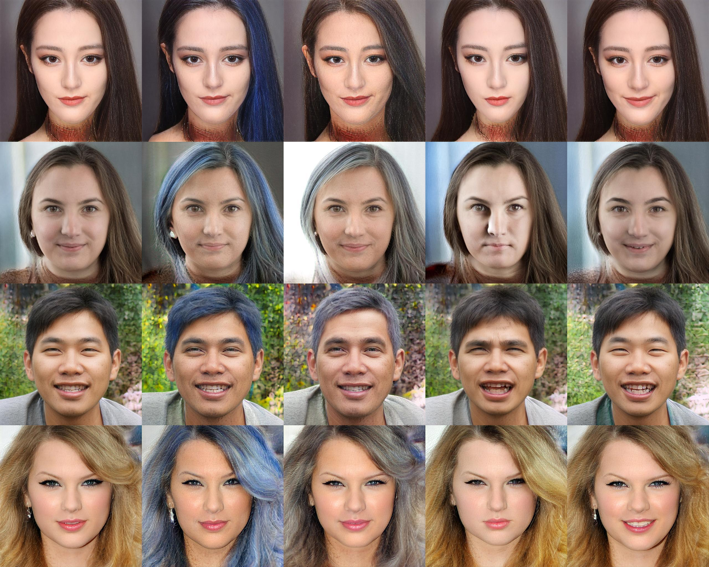
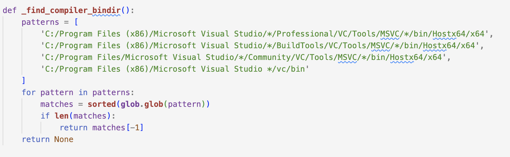

# 3dface-editting

基于EG3D+PTI的人脸姿势和风格变化


# 效果展示

## pose变化


## style变化



## 视频效果

好像readme里看不了，可以去`./pic_show`里看

[![Video]](./pic_show/output_video.mp4)

# 前置要求

首先下载这个文件

```
https://drive.google.com/file/d/1yYCeiZXbFatYObGhUXyvk2aHyfG8KYjY/view?usp=sharing
```

这个文件包含`align.dat`文件和`BFM`、`checkpoints`文件夹，把`BFM`和`checkpoints`放到`./preprocess/`文件夹下面，把`align.dat`放到`./inversion/utils/`下

然后安装nvdiffrast

```
cd preprocess/nvdiffrast
pip install .
```

然后下载这个

```
https://drive.google.com/file/d/1xwMlnPSvbfjQ4AHoJogs1ldKLitSwCcc/view?usp=sharing
```
把下载好的文件放入`./inversion/utils/`中
然后修改`./inversion/configs/paths_config.py`文件，

# 运行测试

```python
python webui.py
```

```python
cd inversion
python run_optimization.py
```

# 可能遇到的问题

## nvidiffrast

```
RuntimeError: glLinkProgram() failed:
Fragment info
-------------
0(2) : error C7528: OpenGL reserves names starting with 'gl_'
(0) : error C2003: incompatible options for link
```

修改`nvdiffrast/common/rasterize.cpp`，删除/注释带有`in int gl_`的行

## UTF-8 with rom

```
UnicodeDecodeError: 'cp949' codec can't decode byte 0xbf in position 2: illegal multibyte sequence
```

修改所有文件，将UTF-8 with rom格式的文件改成UTF-8的格式，也可以看打印台输出，如果你出现这种问题的话请看打印台输出的文件，修改对应文件即可

## 无法找到C编译器



下载`VS studio`，打开`./inversion/torch_utils/custom_ops.py`，将自己`VS studio`的路径加入上图的函数中的`pattern`中


# 即将完成的

- 和diffusion的对比实验 ❌
- 和基础模型的对比实验 ❌ 
- 消融实验 ❌
- fid ✔
- clip-scores ✔