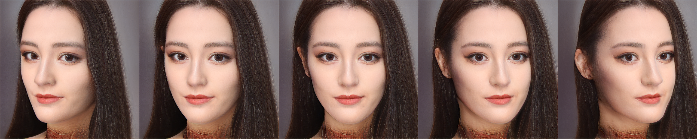

# 3dface-pose-editting

基于EG3D+PTI的人脸姿势变化


# 效果展示



# 前置要求

首先下载这个文件

```
https://drive.google.com/file/d/1yYCeiZXbFatYObGhUXyvk2aHyfG8KYjY/view?usp=sharing
```

这个文件包含`align.dat`文件和`BFM`、`checkpoints`文件夹，把`BFM`和`checkpoints`放到`./preprocess/`文件夹下面，把`align.dat`放到`./inversion/utils/`下

然后安装nvdiffrast

```
cd preprocess/nvdiffrast
pip install .
```

然后下载这个

```
https://drive.google.com/file/d/1xwMlnPSvbfjQ4AHoJogs1ldKLitSwCcc/view?usp=sharing
```
把下载好的文件放入`./inversion/utils/`中
然后修改`./inversion/configs/paths_config.py`文件，


# 可能遇到的问题

## nvidiffrast

## UTF-8 with rom
